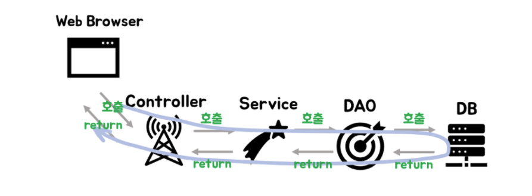
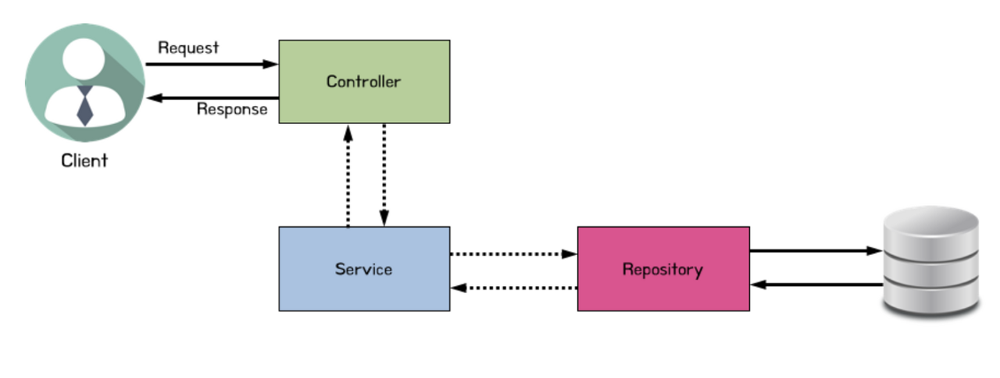

## Controller란

> Controller은 MVC에서 C에 해당하며 주로 사용자의 요청을 처리한 후 지정된 뷰에 모델 객체를 넘겨주는 역할을 한다.

> 즉, 사용자의 요청이 진입하는 지점이며 요청에 따라 어떤 처리를 할지 결정을 Service에 념겨준다. 그 후 Service에서 실질적으로 처리한 내용을 View에게 넘겨준다.

### Controller 사용 이유

> 역할에 따라 설계를 하고 코딩을 하면 개발비용이나 유지보수비용이 대폭 줄어들기 때문에 Controller를 사용한다고 한다.

---
## @Controller(Spring MVC Controller)

* 전통적인 Spring MVC의 컨트롤러인 @Controller는 주로 View를 반환하기 위해 사용한다.

* @ResponseBody 어노테이션과 같이 사용하면 RestController와 똑같은 기능을 수행할 수 있다.

```java
@Controller
public class Controllerprac {
    @GetMapping("/home") //home으로 Get요청이들어오면
    public String homepage(){
        return "home.html"; //home.html생성
    }
}
```
---
## RestController란

* @Controller에 @ResponseBody가 더해진 것

* Json 형태로 객체의 데이터를 반환하는 것

### 사용 이유
1. 간결한 코드
    > 간단한 어노테이션 설정으로 웹 요청과 응답을 처리 할 수 있다.

2. HTTP Method 지원
    > 각각의 메서드에 HTTP Method를 지정해서 다양한 종류의 요청을 처리할 수 있다.

3. RESTful 설계 원칙 준수
    > RESTful 웹 서비스의 설계 원칙을 더 쉽게 준수할 수 있다.
---
## Service란

1. Client가 Request를 보낸다

2. Request URL에 알맞은 Controller가 수신 받는다.

3. Controller는 넘어온 요청을 처리하기 위해 Service를 호출한다.

4. Service는 알맞은 정보를 가공하여 Controller에게 데이터를 넘긴다.

5. Controller는 Service의 결과물을 Client에게 전달해준다.

### 사용 예시
```java
@Service
public class BoardServiceImp implements BoardService
{
	@Autowired
	BoardRepositroy repo;
	public List<BoardEntity> findAll()
	{
		return repo.findAll();
	} 
}
```

## DAO란

* 페이지를 불러오고 DB정보를 한번에 불러오는 간단한 프로젝트의 경우 Service와 DAO는 차이가 거의 없을 수 있다고 한다.

* DAO는 쉽게 말해 Mysql 서버에 접근하여 SQL문을 실행할 수 있는 객체

## DAO and JPA

* Spring Data JPA는 매우 적은 코드로 DAO를 구현할 수 있도록 해준다.

* 인터페이스에 메소드를 선언하는 것 만으로 라이트한 쿼리를 수행하는 코드를 만드는 것과 동등한 작업을 수행한다.



---
## Reposity란

* Entity에 의해 생성된 DB에 접근하는 메서드 들을 사용하기 위한 인터페이스

* @Entity라는 어노테이션으로 데이터베이스 구조를 만들었다면 여기에 CRUD를 해야되는 것을 어떻게 할지를 정의하는 계층


