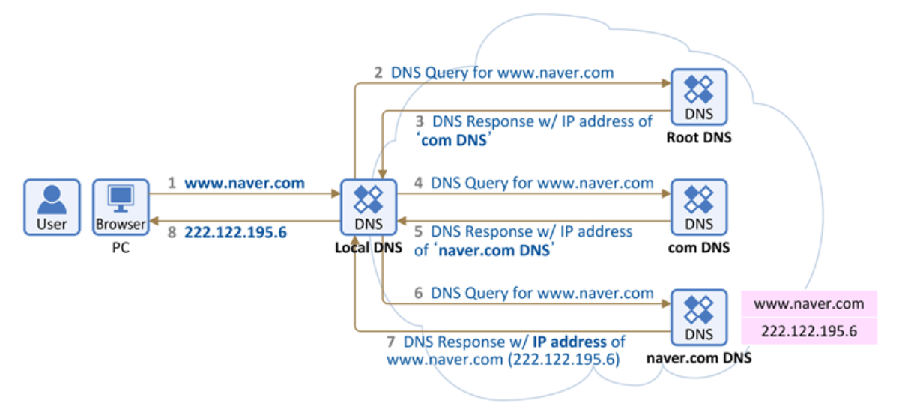

## DNS(Domain Name System)란

* IP 네트워크에서 사용하는 시스템이다. 우리가 인터넷을 편리하게 쓰게 해주는 것

* 영문/한글 주소를 IP 네트워크에서 찾아 갈 수 있는 IP로 변환해 준다.
---
## DNS의 작동 원리

* 퍼블릭 DNS
    > 일반적으로 인터넷 서비스 제공업체가 기억에 IP레코드를 제공한다. 이런 레코드는 일반 대중에게 제공되며, 사용 중인 디바이스 또는 디바이스에 연결된 네트워크에 상관없이 누구나 액세스할 수 있다.

* 프라이빗 DNS
    > 프라이빗 DNS는 회사의 방화벽 뒤에 존재하며 내부 사이트의 레코드만을 보관한다는 점에서 퍼블릭 DNS와 다르다.
---
## DNS 서버 선택 방법

* 어느 유형의 DNS 서버를 사용할지 결정할 때 두 가지 중요한 고려 사항은 서버의 확장성과 성능이다.

* DNS 서버가 쿼리에 응답하는 속도는 서버와 상대적으로 사용자가 위치한 지리적 위치, 로드 밸런싱 구성 및 쿼리 필터링 등 여러 가지 변수에 따라 달라진다.

* 사용자가 선택할 수 있는 또 다른 옵션은 DDI 솔루션이다. 이 솔루션은 모든 DNS, DHCP, IPAM 서비스를 통합하고 관리하는 중앙집중식 플랫폼이다.
---
## DNS 동작 방식

1. 웹 브라우저에 www.naver.com을 입력하면 먼저 PC에 저장된 Local DNS에게 "www.naver.com"이라는 hostname에 대한 IP 주소를 요청한다.

2. 그러면 Local DNS는 이제 "www.naver.com의 IP 주소"를 찾아내기 위해 다른 DNS 서버들과 통신을 시작한다.

3. Root DNS서버는 "www.naver.com의 IP 주소"를 찾을 수 없어 Local DNS 서버에게 "www.naver.com의 IP 주소를 찾을 수 없다고 다른 DNS 서버에게 물어봐"라고 응답한다.

4. 이제 Local DNS 서버는 com도메인을 관리하는 TLD DNS 서버에 다시 www.naver.com에 대한 IP 주소를 요청한다.

5. com 도메인을 관리하는 DNS 서버에도 해당 정도가 없으면, Local DNS 서버에게 "www.naver.com의 IP 주소 찾을 수 없음. 다른 DNS 서버에게 물어봐"라고 응답한다.

6. 이제 Local DNS 서버는 naver.com DNS 서버에게 다시 "www.naver.com의 IP 주소"를 요청한다.

7. naver.com DNS 서버에는 "www.naver.com의 IP 주소"가 있으니깐 Local DNS 서버에게 "www.naver.com에 대한 IP주소는 222.122.195.6"라는 응답을 한다.

8. 이를 수신한 Local DNS는 www.naver.com의 IP 주소를 캐싱하고 이후 다른 요청이 있을 시 응답할 수 있도록 IP 주소 정보를 단말에 전달해준다.