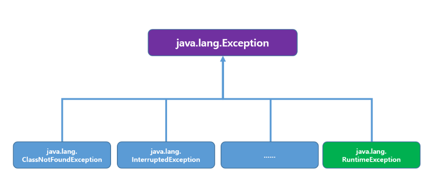

## Exception

* 예외는 error의 일종이며 프로그램이 수행시 또는 컴파일시에 불능상태를 만든다.

* 예외 처리란 Exception 예외가 발생할 것을 대비해서 미리 예측해 이를 소스상에서 제어하고 처리하도록 만드는 것

* 예외 처리를 하게되면 갑작스러운 Exception이 발생하여도 시스템 및 프로그램이 불능상태가 되지 않고 정상 실행 상태를 유지할 수 있다.
---
### 종류

1. 컴파일 시점에 발생하는 예외를 Exception(일반예외)

2. 프로그램 실행시에 발생하는 예외를 RuntimeException(실행예외)

* Exception을 처리하기 위해 자바에서 `java.lang.Exception`이라는 최상위 부로 클래스를 제공한다.

---
### 예외처리 코드 및 실행 순서
 

> `Try -> Catch -> Finally`

* Try: 실제 코드가 들어가는 곳, 예외 Exception이 발생할 가능성이 있는 코드

* Catch: Try블록에서 Exception이 발생하면 코드 실행 순서가 Catch 쪽으로 오게된다. **예외에 대한 후 처리 코드**

* Finally: Try블록에서의 Exception과 발생 유무와 상관없이 무조건 수행되는 코드
---
### Exception 발생
 

**Try 블록 수행 -> Catch 블록 수행 -> Finally 블록 수행 (생략 가능)**

### Exception 미발생
 

Try 블록 수행 -> Finally 블록 수행(생략가능)