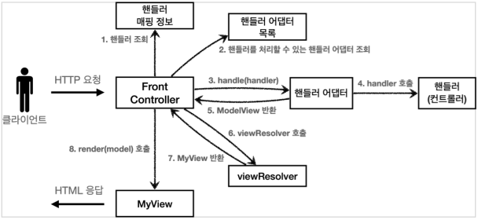

## MVC(Model View Controller)란

* MVC 패턴은 애플리케이션을 개발할 때 사용하는 디자인 패턴

* 애플리케이션의 개발 영역을 MVC로 구분해서 각 역할에 맞게 코드를 작성하는 개발 방식
---
### Model

* Spring MVC 기반의 웹 애플리케이션이 클라이언트의 요청을 전달받으면 요청 사항을 처리하기 위한 작업을 한다.

* 클라이언트에게 응답으로 돌려주는 작업의 처리 결과 데이터를 Model이라고 한다.

* 클라이언트의 요청 사항을 구체적으로 처리하는 영역을 서비스 계층이라고 하고, 요청 사항을 처리하기 위해 Java 코드로 구현한 것을 비즈니스 로직이라고 한다.
---
### View

* View는 Model을 이용해서 웹 브라우저와 같은 애플리케이션의 화면에 보이는 리소스를 제공하는 역할을 한다.

* Spring MVC에 다양한 View 기술
    1. **HTML 페이지 출력**

    2. **PDF, Excel 등의 문서 형태로 출력**

    3. **XML,JSON 등 특정 형식의 포맷으로 변환**
---
### Controller

* 클라이언트 측의 요청을 직접적으로 전달받는 엔드포인트로써 Model과 View의 중간에서 상호작용을 해주는 역할

* 클라이언트 측의 요청을 전달받아 비즈니스 로직을 거쳐 Model 데이터가 만들어지면 이 Model 데이터를 View로 전달하는 역할
---
## MVC 패턴 구조

* 여러 가지 구조를 가진 MVC 패턴 중 위 그림의 구조를 그대로 사용하는 것이 Spring MVC이다.

* 일반 MVC 패턴도 유지보수하기에 좋지만 구조가 복잡해지는 것을 극복한 것이 **Spring MVC!!**
---
## Spring MVC의 동작 방식과 구성 요소

### DispatcherServlet
* HttpServlet을 상속받아서 사용하고, 서블릿으로 동작한다.

### 요청 흐름
* 서블릿이 호출되면 HttpSevlet이 제공하는 service()가 호출된다.

    > 서블릿: 동적 웹 페이지를 만들 때 사용되는 자바 기반의 웹 애플리케이션 프로그래밍 기술이다. 서블릿은 웹 요청과 응답의 흐름을 간단한 메서드 호출만으로 체계적으로 다룰 수 있게 해준다.

* 스프림 MVC는 FramworkServlet.service()를 시작으로 여러 메서드가 호출되면서 **DispacherServlet.doDispatch()**가 최종적으로 호출된다.

### 동작 순서
1. 핸들러 조회
    > 컨트롤러 매핑을 통해 URL에 매핑된 컨트롤러를 조회한다.

2. 핸들러 어댑터 조회
    > 컨트롤러를 실행할 수 있는 컨트롤러 어댑터를 조회한다.

3. 핸들러 어댑터 실행
    > 컨트롤러 어댑터를 실행한다.

4. 핸들러 실행
    > 컨트롤러 어댑터가 실제 컨트롤러를 실행한다.

5. ModelAndView 반환
    > 컴트롤러 어댑터는 컨트롤러가 반환하는 정보를 ModelAndView로 변환하여 반환한다.

6. viewResolver 호출
    > 뷰 리졸버를 찾고 실행한다.

7. View 반환
    > 뷰 리졸버는 뷰의 논리 이름을 물리 이름으로 바꾸고, 렌더링 역할을 담당하는 뷰 객체를 반환한다.

8. 뷰 렌더링
    > 뷰를 통해 뷰를 렌더링한다.
---
### 인터페이스
* 스프링 MVC의 큰 장점은 DispatcherServlet 코드의 변경 없이 원하는 기능을 변경하거나 확장할 수 있다는 것

* 동작에 필요한 대부분의 기능을 확장할 수 있도록 인터페이스로 제공한다.

* 인터페이스들만 구현하여 DispatcherServlet에 등록하면 원하는 기능의 컨트롤러를 만들 수도 있다.

