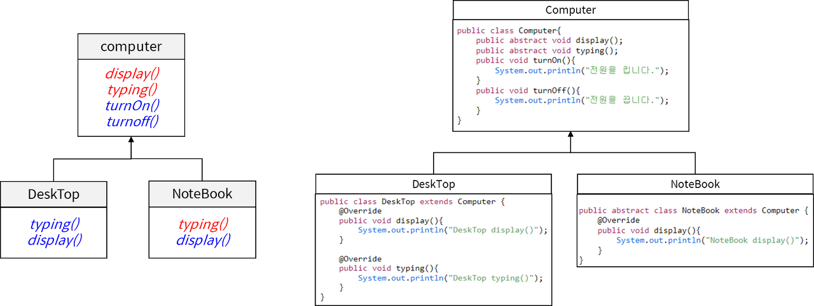
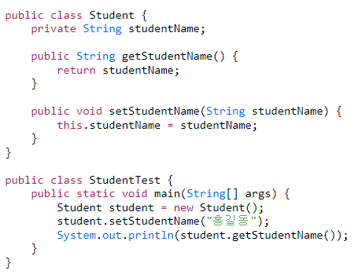
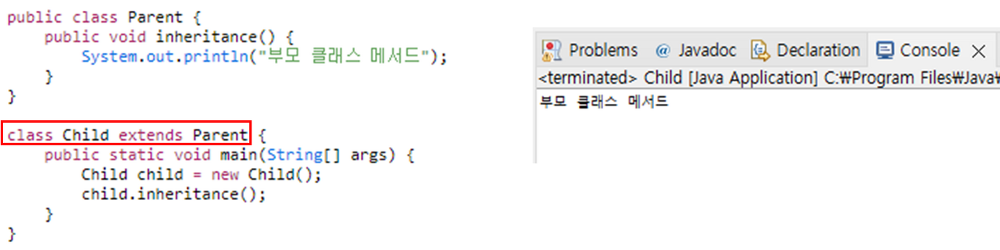
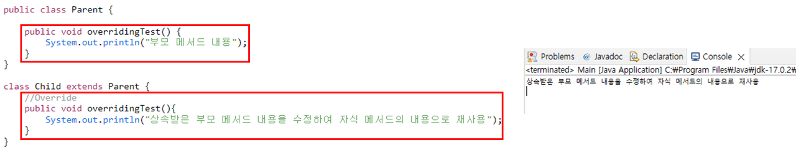
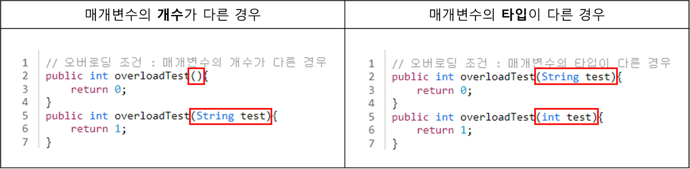

# OOP의 4대 기본원칙

> **OOP의 원칙을 지켜야하는 이유**는 객체들의 관계를 **명확**하게 **정의**하여 **역할**과 **책임**을 **분리**하고, 캡슐화를 통해 **객체의 내부를 감추며** **협력을 강화**하여 **유연**하고 확장 가능한 시스템을 구출할 수 있게 하기 때문이다.

## 추상화

*  객체들의 공통적인 특징(속성, 기능)을 뽑아 이름을 붙이는 것

    * 클래스 vs 객체
        > 클래스: 분류에 대한 개념 -> 같은 특성을 지닌 여러 객체를 총징하는 집합의 개념

        > 객체: 실체 -> 유일무이한 사물

    * 추상화: 구체적인 것을 분해해서 관심 영역에 있는 특성만 가지고 재조합하는 것

    
---
## 캡슐화

* 특정 객체가 독립적으로 역할을 제대로 수행하기 위해 필요한 데이터와 기능을 하나로 묶은 것

* 정보를 객체 안에 포함시키고, 그 정보에 대한 직접 접근을 허용하지 않는 대신, 필요에 따라 확인할 수 있는 인터페이스를 외부에 공개하는 방식

### 접근 제어자

1. public - All

2. protected - 클래스,패키지,상속

3. defailt - 클래스, 패키지

4. private - 클래스

---
## 상속화

* 상위 개념의 특징을 하위 개념이 물려받는 것

    * **하위 클래스 - 상위 클래스**
        > 하위 클래스는 상위 클래스 특성을 재사용하고, 확장한다.

    * **인터페이스**
        > 다중 상속 대신 도입
        
        > 어떤 객체가 해야할 일을 정의하는 추상 자료형

        > 구현 클래스 is able to 인터페이스(ex. Runnable)

        > 인터페이스는 구현을 강제할 메서드가 적을 수록 좋다

---
## 다형화

* 모듈이 갖고있는 정체성과 표현방식

* 다형성을 극대화 하기 위해 추상 클래스나 인터페이스를 이용한다.

    * 오버라이딩
        > 같은 메서드 이름 / 같은 인자 목록 / 상위 클래스의 메서드 재정의

        > 상위 클래스 타입의 객체 참조 변수에서 자동으로 하위 클래스가 오버라이딩한 메소드를 호출해 줌

    

    * 오버로딩
        > 같은 메서드 이름/다른 인자 목록/다수의 메서드 중복 정의

    