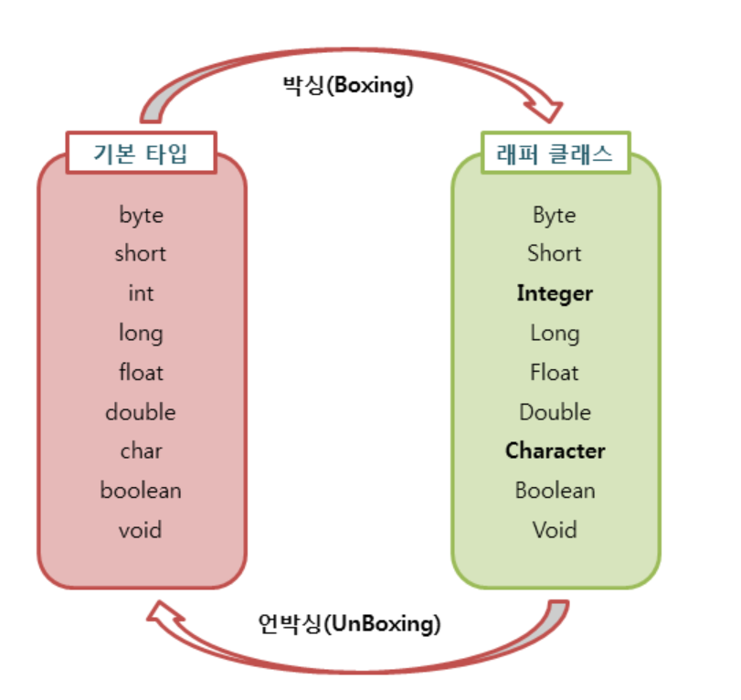

## Wrapper 클래스란
* 프로그램에 따라 기본 타입의 데이터를 객체로 취급해야 하는 경우가 있다.

* 8개의 기본 타입에 해당하는 데이터를 객체로 포장해 주는 클래스!!

* 래퍼 클래스는 각각의 타입에 해당하는 데이터를 인수로 전달받은 후, 해당 값을 가지는 객체로 만들어 준다.

* java.lang 패키지에서 제공된다.

|기본타입|래퍼 클래스|
|-------|---------|
|byte|Byte|
|short|Short|
|int|Integer|
|long|Long|
|float|Float|
|double|Double|
|char|Character|
|boolean|Boolean|
---

## 박싱(Boxing)과 언박싱(Unboxing)



* 기본 타입의 데이터를 래퍼 클래스의 인스턴스로 변환하는 과정을 박싱이라고 한다.

* 래퍼 클래스의 인스턴스에 저장된 값을 다시 기본 타입의 데이터로 꺼내는 과정을 언박싱이라고 한다.

## 오토 박싱(AutoBoxing)과 오토 언박싱(AutoUnboxing)

* JDK 1.5부터는 박싱과 언박싱이 필요한 상황에서 자바 컴파일러가 이를 자동으로 처리해준다.

### 예제
```java
Integer num = new Integer(17); // 박싱

int n = num.intValue();        // 언박싱

System.out.println(n);

 

Character ch = 'X'; // Character ch = new Character('X'); : 오토박싱

char c = ch;        // char c = ch.charValue();           : 오토언박싱

System.out.println(c);
```

* 오토 박싱을 이용하면 new키워드를 사용하지 않고도 자동으로 Character인스턴스를 생성할 수 있다.

* 래퍼 클래스도 객체이기때문에 동등 연산자를 사용하게 되면, 두 인스턴스의 값을 비교하는 것이 아니라 두 인스턴스의 주소값을 비교한다!
